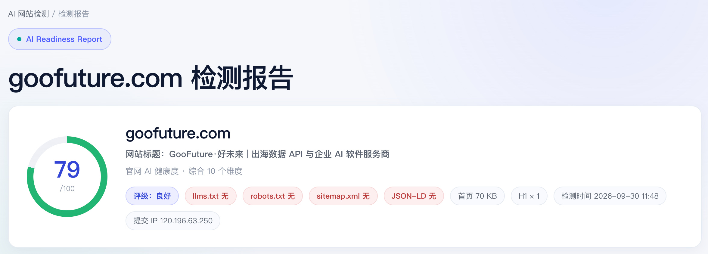

# 企业网站GEO检测 · WorkBuddy Skill 技能

一份**纯标准库、零第三方依赖**的「企业官网 AI 可读性」检测工具。它能在你自己的机器上
抓取企业官网、计算 10 个维度的 AI 可读性评分、生成自包含报告，并**可选**把检测结果
提交到 [GooFuture 官网](https://goofuture.com/company-website-ai-agent/ai-check/) 进行公开收录。

- 在线体验（GooFuture 托管版）：https://goofuture.com/company-website-ai-agent/ai-check/
- 本仓库与其评分逻辑**完全一致**，可离线运行、二次开发、嵌入你自己的工具链。  

示例报告：[goofuture.com 检测报告](https://goofuture.com/company-website-ai-agent/ai-check/reports/goofuture.com-report.html)  
  

---

## 它能做什么

1. **抓取**目标企业官网首页（带 SSRF 防护，自动解压 gzip / deflate / br）。
2. **评分** 10 个维度的「AI 可读性」，输出 0–100 综合分与评级（优秀 / 良好 / 中等 / 偏弱 / 较弱）。
3. **生成报告**：自包含 HTML（视觉与官网报告页一致）+ Markdown。
4. **提交收录**（可选）：回传到 GooFuture 官网的 `detect.php?action=save`，由官网生成公开报告
   并纳入检测列表，并返回公开报告链接与 SKILL 下载链接。

## 10 个评分维度

| 维度 | 维度 | 维度 |
|---|---|---|
| 企业信息完整度 | 产品信息完整度 | AI 可理解性 |
| 内容结构化 | FAQ 完整度 | 联系方式 |
| 图片信息识别 | PDF / 文档利用 | AI 引用友好度 |
| | | Agent 友好度 |

## 快速开始

需要 Python 3.8+，**无需安装任何第三方依赖**。

```bash
# 克隆（或下载）后进入目录
cd ai-website-check-skill

# 1) 只评分，输出 JSON
python3 ai_check/cli.py analyze "https://example.com/"

# 2) 生成本地报告（HTML + Markdown）
python3 ai_check/cli.py report "https://example.com/" --out ./reports --format both

# 3) 一站式：评分 + 报告 + 可选提交收录
python3 ai_check/cli.py check "https://example.com/" --out ./reports --submit
```

## CLI 命令

| 命令 | 作用 |
|---|---|
| `analyze <url>` | 抓取 + 评分，输出 JSON（程序化消费） |
| `report <url> [--out DIR] [--format html\|md\|both]` | 本地生成报告 |
| `submit <url> [--ai]` | 检测并提交到 GooFuture 官网收录 |
| `check <url> [--out DIR] [--submit] [--ai]` | 一站式：评分 + 报告 + 可选提交 |

> 运行 `python3 ai_check/cli.py -h` 查看完整帮助。

## 作为 WorkBuddy / 其他 AI 工具 的 SKILL 使用

本仓库根目录已包含 `SKILL.md`，可直接作为 **WorkBuddy 技能** 导入：

1. 把整个 `ai-website-check-skill/` 目录放到 WorkBuddy 的技能目录
   （用户级：`~/.workbuddy/skills/ai-website-check-skill/`；项目级：`<项目>/.workbuddy/skills/ai-website-check-skill/`）。
2. 在对话中让 AI 助手「检测 xxx.com 的 AI 可读性」即可，技能会自动调用 `ai_check/cli.py`。
3. 提交收录前，AI 会先征求你的同意（对外提交属于公开收录）。

任何支持「SKILL / 指令文件」的 AI 工具，都可以直接读取 `SKILL.md` + `ai_check/` 来复用本能力。

## 提交到 GooFuture 官网收录

- 接口：`https://goofuture.com/company-website-ai-agent/ai-check/detect.php`，动作 `action=save`（公开、无需令牌）。
- 提交后官网会生成公开报告并纳入列表；**同名域名会被覆盖更新**。
- 提交前请确认你有权限公开该网站的检测结果。
- 若想自建收录后端，把 `ai_check/submit.py` 里的 `GOOFUTURE_SAVE_URL` 改成你自己的 `detect.php` 地址即可
  （后端逻辑参考 GooFuture 线上 `detect.php` 的 `action=save`）。

## 可选：DeepSeek AI 深度解读

设置环境变量 `DEEPSEEK_API_KEY` 并加 `--ai`，会自动调用 DeepSeek 生成「AI 深度解读」，
本地报告与官网收录报告都会包含该解读：

```bash
export DEEPSEEK_API_KEY="你的 DeepSeek Key"
python3 ai_check/cli.py check "https://example.com/" --out ./reports --submit --ai
```

## 工作原理（简述）

1. 抓取首页 → 探测 `llms.txt` / `robots.txt` / `sitemap.xml` / JSON-LD 是否可达；
2. 用正则对首页 HTML 计算 10 个维度得分（企业信息、产品、正文量、结构、FAQ、联系方式、图片 alt、文档、引用基建、Agent 友好度）；
3. 10 维平均得到综合分，并选出最弱的 3 项作为优先优化建议；
4. 渲染报告，或回传官网收录。

## 许可证

[MIT](./LICENSE) © 2026 广州果创网站科技有限公司（GooFuture）
